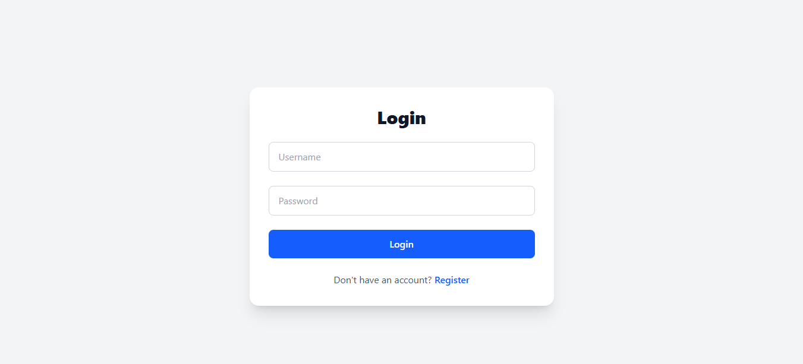
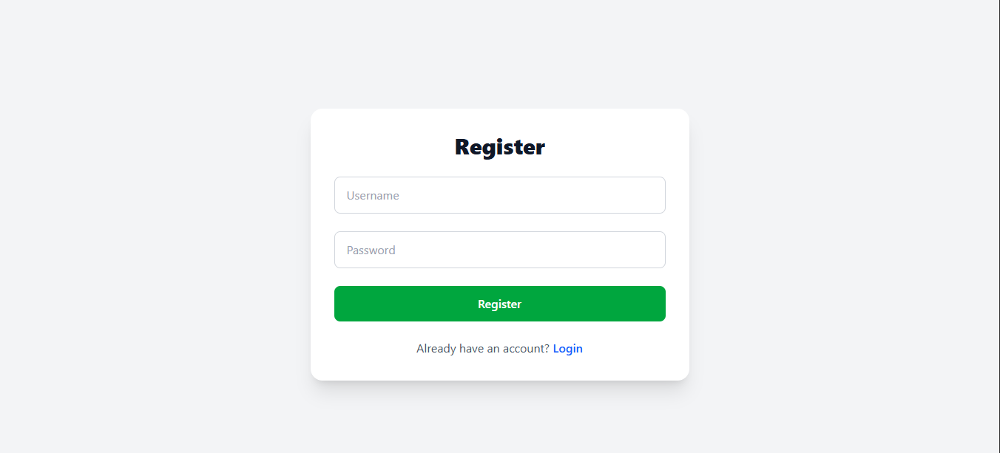
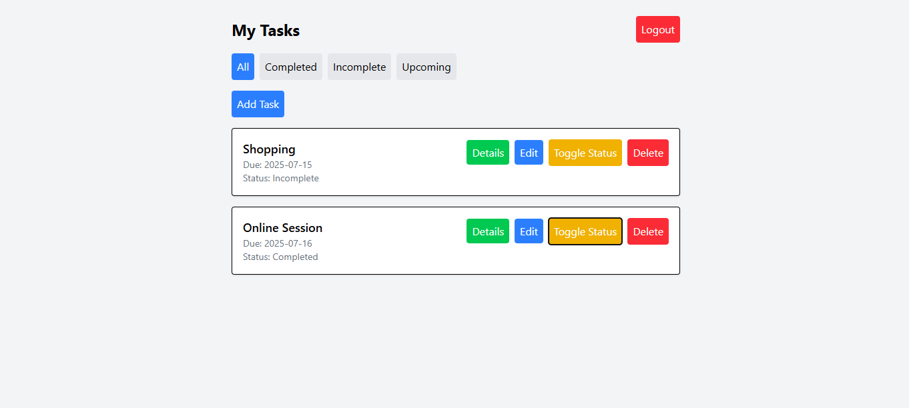
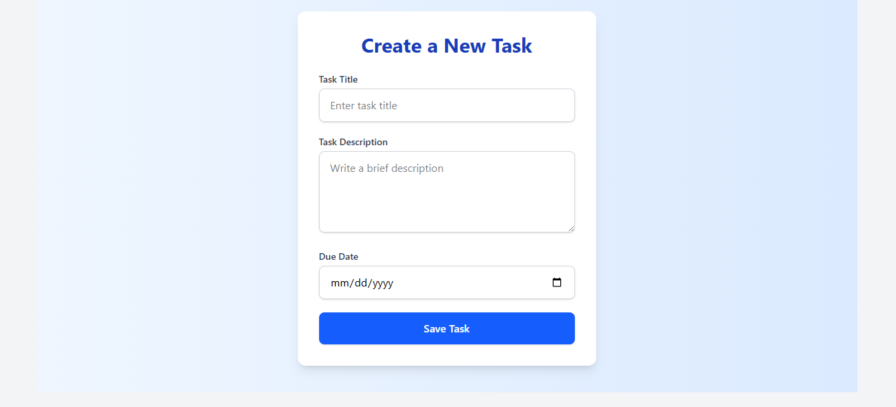
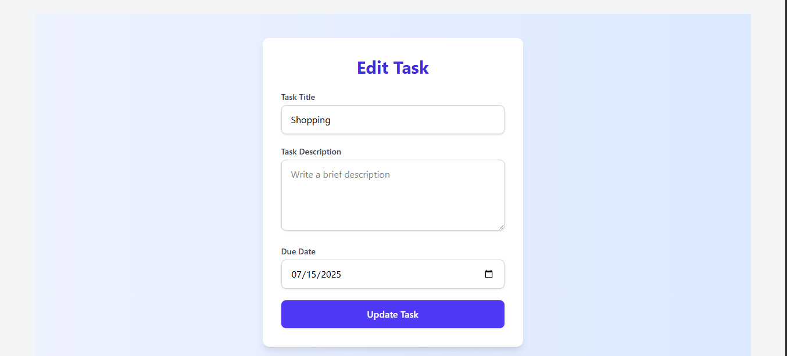
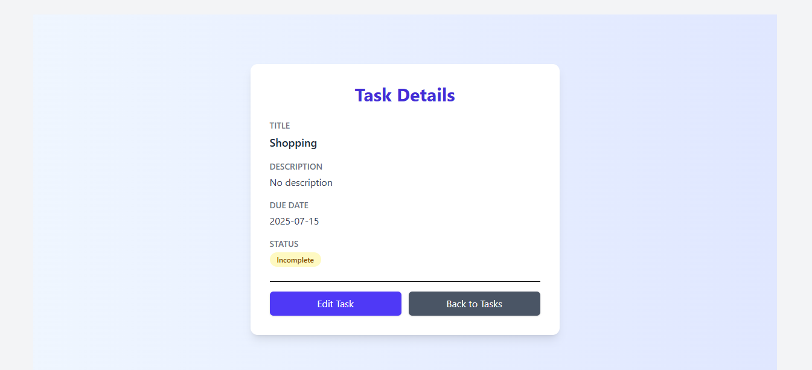

# To-Do Application

## Setup

### Backend (Django)
1. Clone the repository: `git clone https://github.com/Hasninemamud/ToDo-App.git`
2. Navigate to `todo_api/`: `cd todo_api`
3. Create a virtual environment: `python -m venv venv`
4. Activate: `.\venv\Scripts\activate` (Windows)
5. Install dependencies: `pip install -r requirements.txt`
6. Run migrations: `python manage.py migrate`
7. Start server: `python manage.py runserver`

### Frontend (Vite + React)
1. Navigate to `todo-frontend/`: `cd todo-frontend`
2. Install dependencies: `npm install`
3. Start development server: `npm run dev`
4. For production build: `npm run build`

## Usage
- Access the app at `http://localhost:5173`
- Register, log in, and manage tasks.
- Features:
  - Create, view, edit, and delete tasks.
  - View task details.
  - Toggle task status.
  - Filter tasks by All, Completed, Incomplete, or Upcoming (due within 7 days).
  - Reorder tasks using drag-and-drop.
  - User authentication (register, login, logout).

## Deployment
- **Backend**: Deploy to Heroku or Render. Update `CORS_ALLOWED_ORIGINS` with the deployed frontend URL.
- **Frontend**: Deploy to Netlify or Vercel. Run `npm run build` to generate the `dist/` folder and deploy it. Update API base URL in frontend to point to the deployed backend.

## ToDo APP

**Login** 
**Signup** 
**Tasks** 
**Add Task** 
**Edit Task** 
**Task Details** 

# To-Do API Documentation

## Base URL
`http://localhost:8000/api/`

- **Interactive Swagger UI**:  `http://localhost:8000/api/schema/swagger-ui/`

- **ReDoc**: `http://localhost:8000/api/schema/redoc/`

- **Raw Schema**: `http://localhost:8000/api/schema/`

